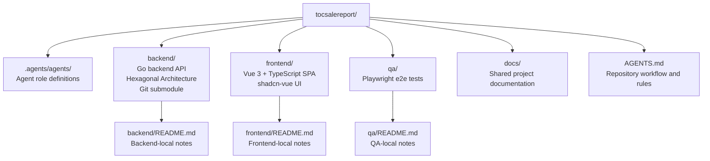
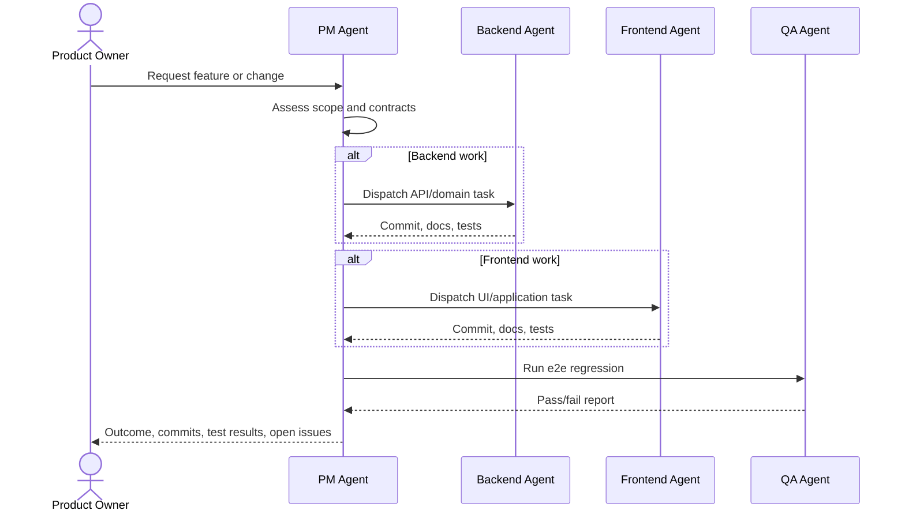

# TOC Sale Report

TOC Sale Report is a sales-reporting project organized as an orchestration repository with separate areas for the backend API, frontend application, QA automation, and shared documentation. The backend and frontend are mounted as Git submodules; QA and shared documentation live in this root repository.

## Project Overview



## Repository Layout

| Path | Purpose | Current status |
| --- | --- | --- |
| `backend/` | Backend API owned by the backend agent. Go API using Hexagonal Architecture. Mounted from `tocsalereport-api`. | Submodule present |
| `frontend/` | Frontend SPA owned by the frontend agent. Target stack: Vue 3, TypeScript, Pinia, vue-router, shadcn-vue. Mounted from `tocsalereport-web`. | Submodule present |
| `qa/` | End-to-end test project owned by the QA agent. Target stack: Playwright and TypeScript. | Root project area present |
| `docs/` | Shared project documentation that applies across backend, frontend, and QA. | Directory present |
| `.agents/agents/` | Agent role definitions for backend, frontend, and QA work. | Present |
| `AGENTS.md` | Root workflow, ownership, architecture, and coordination rules. | Present |

## Agent Workflow



## Architecture Intent

The backend keeps business rules in framework-free domain/application layers, with HTTP, persistence, and external services implemented as adapters.

The frontend separates presentation, domain, and data concerns. UI components render state and handle user events, while data access and business rules stay outside component code.

QA is an independent Playwright project that validates critical user flows through the real UI and checks backend/frontend contract behavior before rollout.

## Backend API Base URL

The backend service runs at `http://localhost:<APP_PORT>` in local development. All versioned API endpoints are served under this base path:

```text
/tocsalereportapi/api/v1
```

For example, the versioned health endpoint is `GET /tocsalereportapi/api/v1/health`. Infrastructure health checks are also available at `GET /healthz`.

## Frontend Web Base Path

The frontend SPA is served under this base path:

```text
/tocsalereport/
```

Local Vite routes are available at `http://localhost:5173/tocsalereport/`. Production nginx redirects `/tocsalereport` to `/tocsalereport/` and serves SPA deep links such as `/tocsalereport/login` and `/tocsalereport/reports`.

See [`docs/frontend-path-prefix.md`](docs/frontend-path-prefix.md) for the implementation notes and QA handoff.

## Documentation & Specifications

- [`CONTEXT.md`](CONTEXT.md): Project domain model, canonical vocabulary, and business rules.
- [`docs/external-sales-database-schema.md`](docs/external-sales-database-schema.md): Data dictionary and schema specifications for upstream `push_products` and `sales_transactions` tables.
- [`docs/sales-import-guide.md`](docs/sales-import-guide.md): Sales ingestion setup and execution guide.
- [`docs/troubleshooting-sale-push-values.md`](docs/troubleshooting-sale-push-values.md): Troubleshooting guide for missing sales values in PUSH vs NON PUSH reports.
- [`docs/adr/0001-in-process-cron-sales-import.md`](docs/adr/0001-in-process-cron-sales-import.md): Architecture Decision Record for In-Process Goroutine Cron and Advisory Lock.

## Getting Started

Clone this repository with submodules, then run project-specific commands from the relevant project directory rather than from the repository root.

```sh
git clone --recurse-submodules <repo-url>
git submodule update --init --recursive
```

Command locations:

```sh
cd backend    # backend commands
cd frontend  # frontend commands
cd qa        # Playwright e2e commands
```

## Development Rules

- Read `AGENTS.md` before starting work in this repository.
- Keep changes inside the owning area: backend in `backend/`, frontend in `frontend/`, QA in `qa/`.
- Update the related docs whenever API contracts, frontend structure, or test flows change.
- Run the relevant local tests before handing work back to the PM agent.
- Run QA e2e regression before considering a feature ready for rollout.
