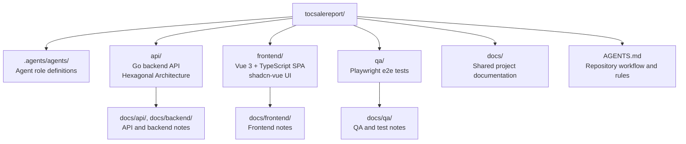
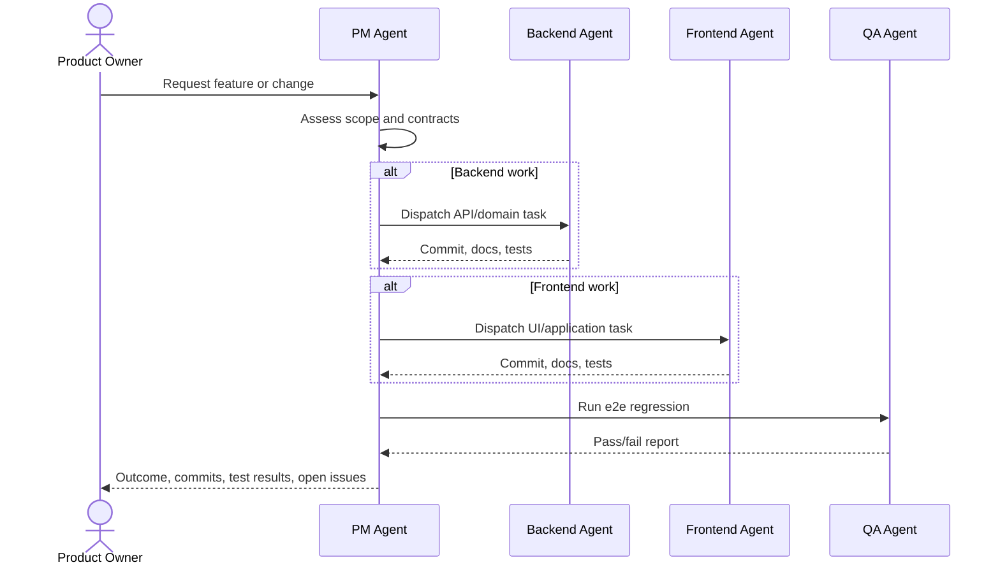

# TOC Sale Report

TOC Sale Report is a sales-reporting project organized as an orchestration repository with separate areas for the backend API, frontend application, QA automation, and shared documentation.

## Project Overview



## Repository Layout

| Path | Purpose | Current status |
| --- | --- | --- |
| `api/` | Backend API owned by the backend agent. Target stack: Go with Hexagonal Architecture. | Scaffold pending |
| `frontend/` | Frontend SPA owned by the frontend agent. Target stack: Vue 3, TypeScript, Pinia, vue-router, shadcn-vue. | Scaffold pending |
| `qa/` | End-to-end test project owned by the QA agent. Target stack: Playwright and TypeScript. | Scaffold pending |
| `docs/` | Shared project documentation for API, backend, frontend, and QA notes. | Scaffold pending |
| `.agents/agents/` | Agent role definitions for backend, frontend, and QA work. | Present |
| `AGENTS.md` | Root workflow, ownership, architecture, and coordination rules. | Present |

## Agent Workflow



## Architecture Intent

The backend keeps business rules in framework-free domain/application layers, with HTTP, persistence, and external services implemented as adapters.

The frontend separates presentation, domain, and data concerns. UI components render state and handle user events, while data access and business rules stay outside component code.

QA is an independent Playwright project that validates critical user flows through the real UI and checks backend/frontend contract behavior before rollout.

## Getting Started

This repository currently contains the project coordination files and empty project areas. After the subprojects are scaffolded, run commands from the relevant project directory rather than from the repository root.

Expected future command locations:

```sh
cd api        # backend commands
cd frontend  # frontend commands
cd qa        # Playwright e2e commands
```

## Development Rules

- Read `AGENTS.md` before starting work in this repository.
- Keep changes inside the owning area: backend in `api/`, frontend in `frontend/`, QA in `qa/`.
- Update the related docs whenever API contracts, frontend structure, or test flows change.
- Run the relevant local tests before handing work back to the PM agent.
- Run QA e2e regression before considering a feature ready for rollout.

