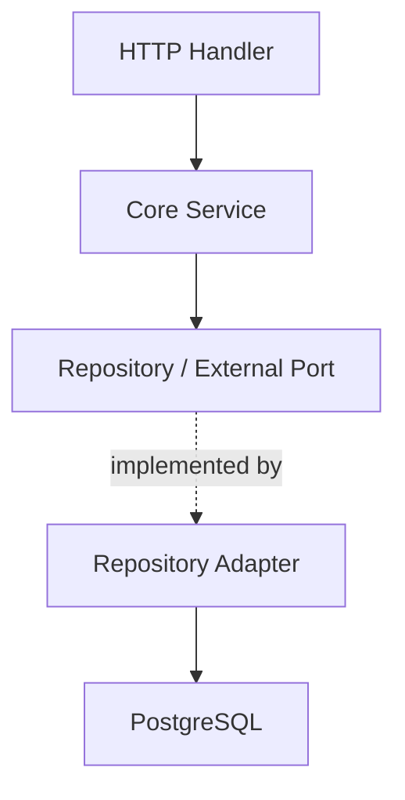

# Backend Architecture

## ภาพรวม

Backend เป็น Go API ใช้ Hexagonal Architecture แบบ modular monolith เป้าหมายคือแยก business logic ออกจาก HTTP, database และ framework เพื่อให้ test ง่ายและพร้อมแยก module เป็น service ในอนาคต

## โครงสร้างหลัก

```text
backend/
├── cmd/api/                         API entry point
├── cmd/service/                     OS service entry point
├── config/                          environment configuration
├── docs/                            generated Swagger docs
├── internal/app/                    dependency wiring และ route registration
├── internal/core/auth/              pure auth domain, ports, services
├── internal/adapters/http/          handlers, middleware, HTTP DTOs
├── internal/adapters/repositories/  GORM repositories และ DB models
└── pkg/                             shared infrastructure packages
```

## Layer Rules

| Layer | ทำหน้าที่ | ห้ามทำ |
| --- | --- | --- |
| `internal/core/<module>/` | domain entity, port, use-case/service | ห้าม import web framework, DB driver, GORM, HTTP DTO |
| `internal/adapters/http/` | parse request, validate input, map status, response DTO | ห้ามใส่ business logic |
| `internal/adapters/repositories/` | persistence adapter, transaction, map DB model เป็น domain | ห้ามให้ DB model รั่วเข้า core |
| `internal/app/` และ `cmd/*` | concrete wiring, startup lifecycle | ห้ามใส่ business rule |

## Module Boundary

ถ้า module หนึ่งต้องใช้ความสามารถของอีก module ให้ประกาศ interface ที่ต้องการใน `port.go` ของ module ตัวเอง แล้ว wire implementation จากภายนอก ห้าม import core package ข้าม module ตรง ๆ



## Test Expectations

- Core service ต้องมี table-driven unit tests และ mock เฉพาะ port/interface
- Core service test ต้องไม่ใช้ database, network หรือ disk I/O จริง
- Repository test เป็น integration test เท่านั้น
- Handler test ตรวจ DTO, validation และ HTTP status mapping
- ก่อนส่งงานต้องรันจาก `backend/`:

```sh
go test ./...
```

ถ้าแก้ Swagger annotation หรือ handler ที่เกี่ยวกับ API docs ให้รัน:

```sh
swag init -g cmd/api/main.go -o docs
```

## Local Run

Backend ต้องมี PostgreSQL และ `.env` ตาม `backend/README.md`

```sh
cd backend
go mod download
go run ./cmd/api
```

Swagger UI จะอยู่ที่:

```text
http://localhost:8080/swagger/index.html
```
