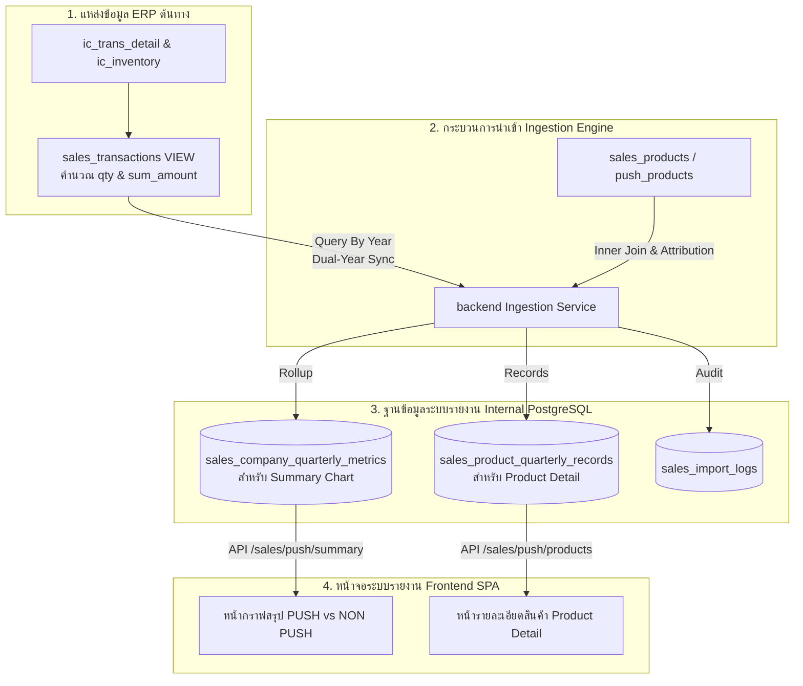

# คู่มือการตรวจสอบปัญหายอดมูลค่าไม่แสดงในรายงาน PUSH vs NON PUSH
## (Troubleshooting Guide: Sale Push & Non-Push Missing Values)

เอกสารนี้รวบรวมแนวทางและขั้นตอนการตรวจสอบ (Troubleshooting Procedures) เมื่อพบปัญหาข้อมูลในรายงาน **Sale Push (PUSH vs NON PUSH)** แสดงจำนวนสินค้า (`qty`) ปกติ แต่มูลค่ายอดขาย (`value`) เป็น 0 หรือไม่แสดงผล โดยเฉพาะในกรณีเรียกดูข้อมูลช่วงปีย้อนหลัง เช่น **2021–2023**

---

## 1. ผังเส้นทางข้อมูล (Data Flow Architecture)

เพื่อระบุตำแหน่งของปัญหาได้อย่างแม่นยำ ให้ทำความเข้าใจเส้นทางของข้อมูลยอดขาย:



---

## 2. ลำดับขั้นตอนการตรวจสอบ (Step-by-Step Investigation)

### ขั้นตอนที่ 1: ตรวจสอบข้อมูลในฐานข้อมูลรายงานภายใน (Internal Database)

จุดเริ่มต้นที่เร็วที่สุดคือตรวจสอบว่าในฐานข้อมูลของระบบรายงานเองมีมูลค่า (`value`) ถูกบันทึกไว้หรือไม่

#### 1.1 ตรวจสอบตารางสรุปภาพรวมรายไตรมาส (`sales_company_quarterly_metrics`)
ใช้สำหรับแสดงผลบนกราฟหน้ารวม ([`SalePushPage.vue`](../frontend/src/presentation/pages/SalePushPage.vue)):

```sql
SELECT 
    company_code,
    channel,
    year,
    quarter,
    qty,
    value
FROM sales_company_quarterly_metrics
WHERE year IN (2021, 2022, 2023)
  AND channel = 'nonpush'
ORDER BY year, quarter, company_code;
```

- **ผลการวิเคราะห์:**
  - **หาก `qty > 0` แต่ `value = 0.0000`**: ปัญหาเกิดขึ้นตั้งแต่ขั้นตอน Ingestion หรือข้อมูลจาก ERP View ส่งค่า 0 เข้ามา ให้ไปตรวจต่อที่ **ขั้นตอนที่ 2 และ 3**
  - **หากไม่มีแถวข้อมูลของปี 2021–2022 เลย**: แสดงว่าระบบยังไม่เคยสั่ง Sync ข้อมูลของปีดังกล่าวเข้ามา ให้ไปดูที่ **ขั้นตอนที่ 3 (Dual-Year Sync)**

#### 1.2 ตรวจสอบตารางระดับสินค้า (`sales_product_quarterly_records`)
ใช้สำหรับแสดงผลในตารางหน้ารายละเอียดสินค้า ([`SalePushProductDetailPage.vue`](../frontend/src/presentation/pages/SalePushProductDetailPage.vue)):

```sql
SELECT 
    p.company_code,
    p.code AS product_code,
    p.name AS product_name,
    r.year,
    r.quarter,
    r.qty,
    r.value
FROM sales_products p
JOIN sales_product_quarterly_records r ON r.product_id = p.id
WHERE r.year IN (2021, 2022, 2023)
  AND (p.push_years IS NULL OR p.push_years = '') -- กรองเฉพาะสินค้า Non-Push
ORDER BY r.year, r.quarter, p.code;
```

---

### ขั้นตอนที่ 2: ตรวจสอบ Database View ต้นทางบนระบบ ERP (`sales_transactions`)

หากในฐานข้อมูลภายในพบ `value = 0` ให้เปิดฐานข้อมูล ERP (External Database) เพื่อตรวจสอบ View [`sales_transactions`](sql/create_erp_sales_transactions_view.sql):

#### 2.1 ตรวจสอบผลรวมยอดขายและมูลค่าจาก View ตรงๆ:
```sql
SELECT 
    year,
    quarter,
    COUNT(*) AS total_rows,
    SUM(qty) AS total_qty,
    SUM(value) AS total_value
FROM sales_transactions
WHERE year IN (2021, 2022, 2023)
GROUP BY year, quarter
ORDER BY year, quarter;
```

#### 2.2 สาเหตุที่พบบ่อยในระดับ ERP ต้นทาง:
1. **ฟิลด์ `sum_amount` ในตาราง `ic_trans_detail` เป็น 0 หรือ NULL:**
   - การคำนวณ `value` ใน View ใช้สูตร:
     ```sql
     SUM(CASE 
         WHEN ic_trans_detail.trans_flag = 48 THEN -1 * ic_trans_detail.sum_amount 
         ELSE ic_trans_detail.sum_amount 
     END) AS value
     ```
   - หากรายการขายในปี 2021–2023 เป็นเอกสารจำพวก **ของแถม, โอนย้ายคลัง, เบิกตัวอย่าง หรือสินค้าทดลอง** ยอดจำนวน (`qty`) จะมีค่า แต่ยอดเงิน (`sum_amount`) จะเป็น 0
2. **การบันทึกมูลค่าของปีเก่าในระบบ ERP:**
   - ในข้อมูลปีย้อนหลัง (2021–2023) ERP อาจมีการจัดเก็บมูลค่าในคอลัมน์อื่นหรือไม่ (เช่น `total_amount`, `net_amount` หรือยังไม่ได้คำนวณตัดหนี้)
3. **เงื่อนไข `trans_flag` ไม่ครอบคลุม:**
   - View กรองเฉพาะ `trans_flag IN (44, 46, 48)` (44=ขายสด, 46=ขายเชื่อ, 48=รับคืน/ลดหนี้)
   - หากในอดีตมีการบันทึกยอดขายด้วย Flag ประเภทอื่น รายการเหล่านั้นจะไม่ถูกดึงเข้ามา

---

### ขั้นตอนที่ 3: ตรวจสอบช่วงปีและประวัติการ Sync (Dual-Year Sync)

ระบบรายงานออกแบบการ Ingest ข้อมูลยอดขายเป็นแบบ **Dual-Year Sync**:
- เมื่อผู้ดูแลระบบสั่ง Sync สำหรับปีเป้าหมาย $Y$ ระบบจะดึงข้อมูลย้อนหลัง 2 ปี คือ **$Y$** และ **$Y-1$** เสมอ
- ตัวอย่างเช่น:
  - หากสั่ง Sync ปี **2023** ระบบจะอัปเดตข้อมูลปี **2022 และ 2023**
  - ข้อมูลปี **2021** จะยังไม่อัปเดต จนกว่าจะมีการสั่ง Sync ปี **2022** (ซึ่งจะดึง 2021 และ 2022) หรือ Sync ปี **2021** โดยตรง

#### 3.1 ตรวจสอบ Audit Log ในตาราง `sales_import_logs`:
```sql
SELECT 
    id,
    trigger_type,
    target_year,
    status,
    execution_ms,
    processed_rows,
    imported_rows,
    error_message,
    created_at
FROM sales_import_logs
WHERE target_year IN (2021, 2022, 2023)
ORDER BY created_at DESC;
```

#### 3.2 วิธีการสั่ง Sync ย้อนหลังให้ครบช่วงปี 2021–2023:
สั่งรัน Ingestion ผ่าน Swagger หรือ cURL ตามลำดับ:
```bash
# 1. Sync ปี 2022 (จะได้ข้อมูลปี 2021 และ 2022)
curl -X POST "http://localhost:8080/tocsalereportapi/api/v1/admin/sales/sync-push?year=2022" \
  -H "Authorization: Bearer <ADMIN_TOKEN>"

# 2. Sync ปี 2023 (จะได้ข้อมูลปี 2022 และ 2023)
curl -X POST "http://localhost:8080/tocsalereportapi/api/v1/admin/sales/sync-push?year=2023" \
  -H "Authorization: Bearer <ADMIN_TOKEN>"
```

---

### ขั้นตอนที่ 4: ตรวจสอบกรณีรันบนสภาพแวดล้อม Dev / Testing (Seed Data)

หากเป็นการทดสอบบนเครื่อง Local/Dev ที่ไม่ได้ต่อฐานข้อมูล ERP จริง:
1. **ไฟล์ `sales-data-template.json`:**
   - ข้อมูล Template ตั้งต้น ([`sales-data-template.json`](../backend/internal/sales/adapter/out/postgres/seed/data/sales-data-template.json)) มีข้อมูลเริ่มต้นเฉพาะปี **2023, 2024, 2025** เท่านั้น ไม่มีข้อมูลปี 2021 และ 2022
2. **ไฟล์ Template ของบางบริษัท (เช่น TOL):**
   - ในไฟล์ [`tol-non-push-product-detail-template.json`](../backend/internal/sales/adapter/out/postgres/seed/data/tol-non-push-product-detail-template.json) ข้อมูลตัวอย่างของสินค้า Non-Push หลายรายการมีเฉพาะค่า `qty` (เช่น -6, -38) แต่ฟิลด์ `value` ถูก Mock ไว้เป็น `0` ทั้งหมด

---

### ขั้นตอนที่ 5: ตรวจสอบการเลือกและการแสดงผลบนหน้าบ้าน Frontend

หากข้อมูลในฐานข้อมูลมีมูลค่า แต่หน้าจอไม่แสดง ให้ตรวจสอบการทำงานของ UI:

1. **ปุ่มเลือก Metric ด้านบน:**
   - ตรวจสอบว่าปุ่มตัวเลือกตัวชี้วัด (Metric Controls) ถูกกดเลือกเป็น **"มูลค่าขาย" (value)** หรือไม่ หากค้างอยู่ที่ **"จำนวน" (qty)** ระบบจะแสดงผลเป็นจำนวนชิ้น
2. **การจัดรูปแบบตัวเลข (Compact Number Formatting):**
   - บนกราฟสรุป ตัวเลขจะถูกฟอร์แมตเป็นหน่วยล้าน:
     ```typescript
     function formatCompactValue(value: number, metric: SalePushMetric) {
       if (metric === 'value') {
         return `฿${(value / 1_000_000).toFixed(1)}M`
       }
       return `${(value / 1_000).toFixed(0)}K`
     }
     ```
   - หากยอดขายจริงมีมูลค่าน้อยมากเมื่อเทียบกับหน่วยล้าน (เช่น ยอดขาย 500 บาท) การคำนวณ `500 / 1,000,000` จะได้ `0.0005` ซึ่งจะถูกปัดเศษแสดงเป็น **`฿0.0M`**
   - ให้ลองนำเมาส์ไปชี้ (Hover) ที่แท่งกราฟเพื่อดู Tooltip ค่าเต็ม

---

## 3. สรุปรายการตรวจสอบแบบรวดเร็ว (Quick Checklist)

| ลำดับ | จุดตรวจสอบ | คำถามที่ต้องตอบ | วิธีแก้ไข |
|:---:|---|---|---|
| 1 | **Frontend UI** | ปุ่มเลือก Metric เป็น "มูลค่าขาย" หรือยัง? | กดเลือกปุ่ม "มูลค่าขาย" |
| 2 | **Internal DB** | ตาราง `sales_company_quarterly_metrics` มี `value > 0` หรือไม่? | ถ้าเป็น 0 แสดงว่ามาจาก Ingestion หรือ ERP View |
| 3 | **Import Logs** | มีรอบการ Sync ปี 2021 และ 2022 สำเร็จหรือไม่? | สั่ง Sync ย้อนหลังผ่าน `/admin/sales/sync-push?year=2022` |
| 4 | **ERP View** | ใน View `sales_transactions` ยอด `value` เป็น 0 หรือไม่? | ตรวจสอบข้อมูลใน `ic_trans_detail.sum_amount` และชนิดเอกสาร |
| 5 | **Dev Environment** | ใช้ข้อมูลจาก Seed Template อยู่หรือไม่? | ข้อมูล Template เริ่มต้นมีเฉพาะปี 2023–2025 |
